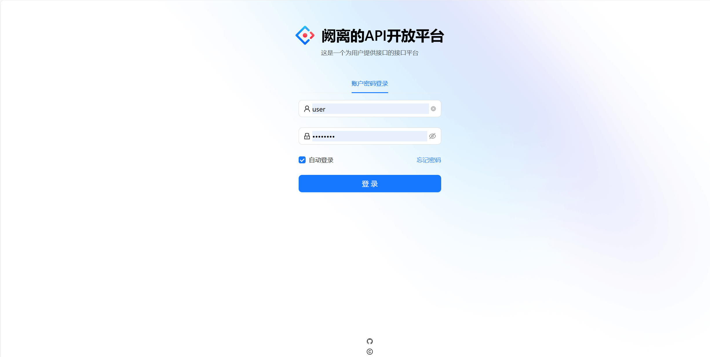
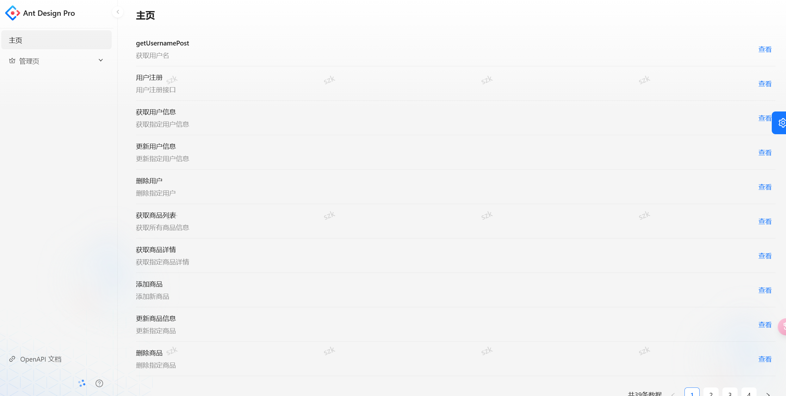
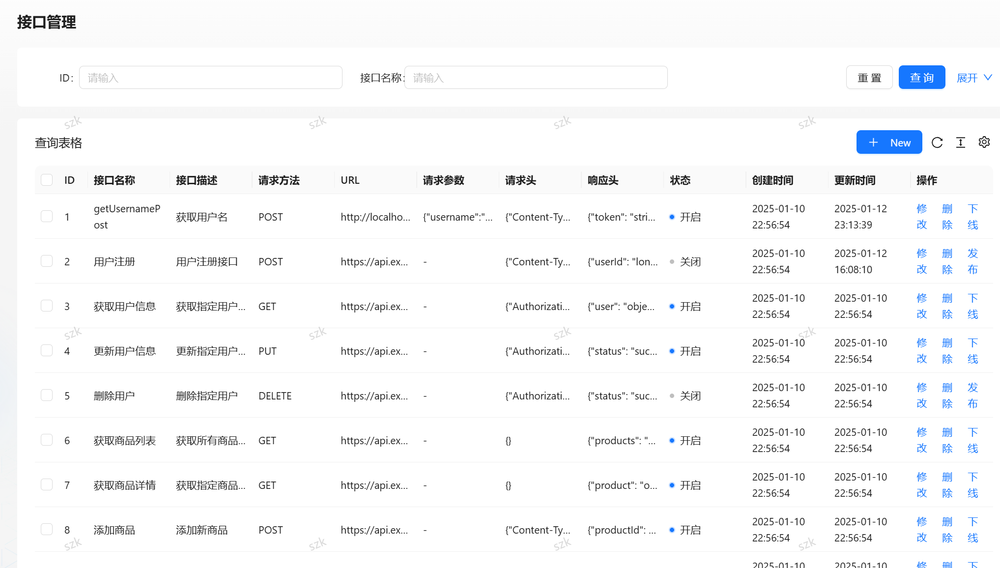
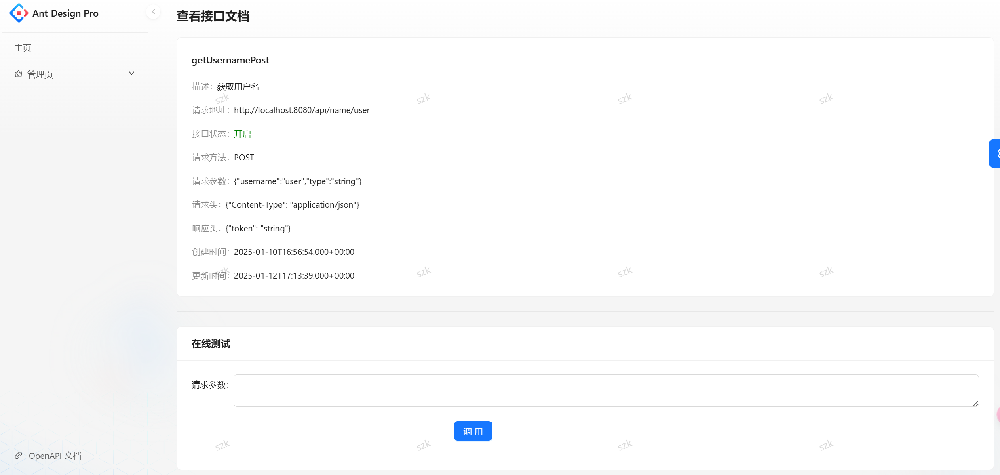
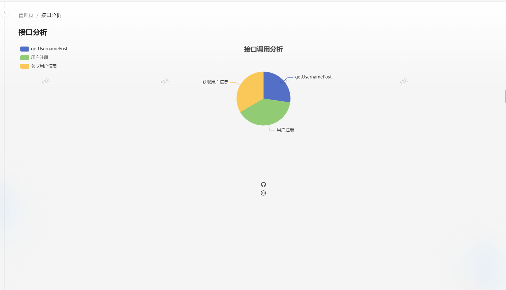
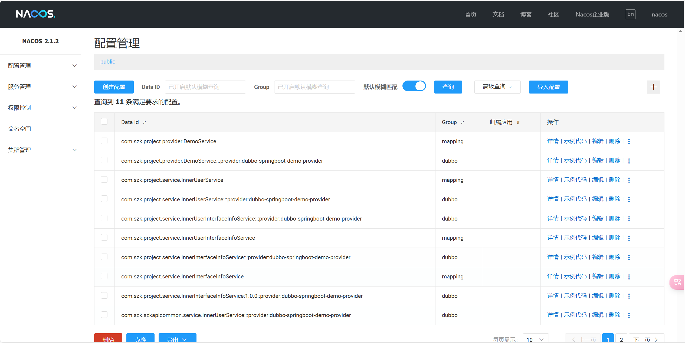

# <h1 style="text-align: center;">阙离的API开放平台</h1>
## 项目截图

# 项目介绍
## 该项目是阙离在线学习项目
### 此项目基于微服务理念构建，采用前后端分离的架构，前端使用React框架，后端使用SpringBoot框架。
前端：html + css+ javascrip + React+组件库Ant Design + Umi + Ant Design pro(现成的管理系统)  
后端：java + spring +springmvc + mybatis + mybatisplus + springboot + mysql + spring cloud gateway（网关）+ swagger + Dubbo +nacos）注册中心   
图表分析：echarts
## 主要功能包括：
1. 接口管理
2. 接口信息查询
3. 提供接口
4. 接口使用分析
## 开发本项目的目的
1. 提升个人技术能力
2. 充分的了解微服务架构
3. 由于在实习期间作为Ai应用工程师，需要参与云边部署，在实际项目中，作为服务的提供方，我一值对云边部署的流程很感兴趣，希望充分了解云边部署的全部流程，于是部署了这个项目，用于了解云边部署云计算的流程。
4. 希望借此理解智慧城市的运行逻辑。
## 本项目应用场景如下
1. 当用户需要接口时，可以调用接口，也可以查看接口的信息，也可以查看接口的使用情况。
2. 作为企业提供接口，比如现在比较火热的GPT、Stable Diffusion、讯飞星火等AI模型，可以作为接口提供给用户使用。企业可以自己开发接口，也可以使用已有的接口进行二次开发。那么接口管理平台的作用就非常明显。具备广阔的应用前景。